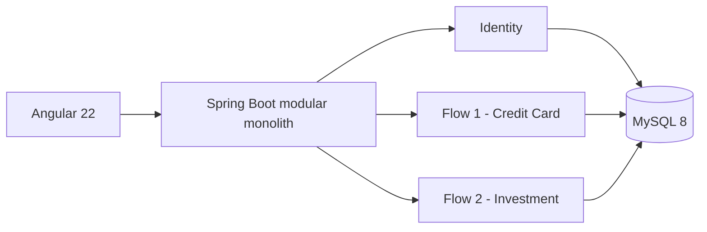

# Kiến trúc

Kira Bank là modular monolith: Angular gọi REST `/api/v1`, Spring Boot áp dụng authentication/ownership/business rules và MySQL giữ dữ liệu qua Flyway. `creditcard` và `investment` là hai bounded context độc lập, chỉ dùng chung identity, attachment, notification và audit.

