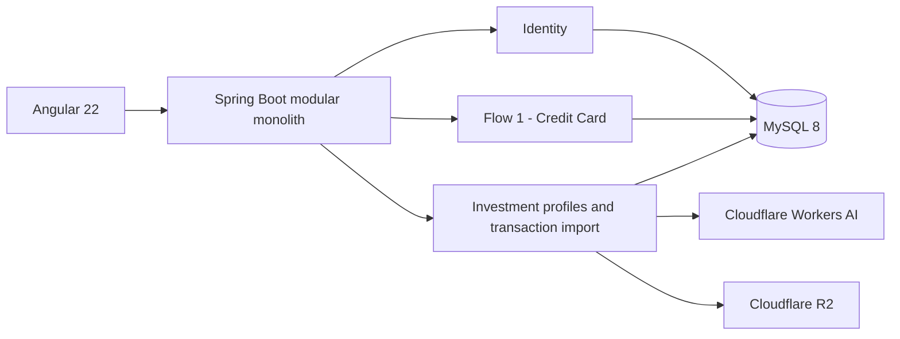

# Kiến trúc

Kira Bank là modular monolith: Angular gọi REST `/api/v1`, Spring Boot áp dụng authentication/ownership/business rules và MySQL giữ dữ liệu qua Flyway. `creditcard` quản lý thẻ, sao kê và payment; `investment` quản lý hồ sơ cùng transaction history nhập qua AI. Hai context dùng chung identity, attachment, notification và audit nhưng không tạo coupling ghi chéo.

Upload lưu attachment và tạo batch nhanh; scheduler claim queue theo lock DB, gửi tối đa 3 ảnh/request và ghi preview staging. Angular polling batch, người dùng chỉnh sửa/resolution, rồi confirm từng item. Scheduler retention hằng ngày purge object R2 đã hết hạn nhưng giữ metadata và source links.
