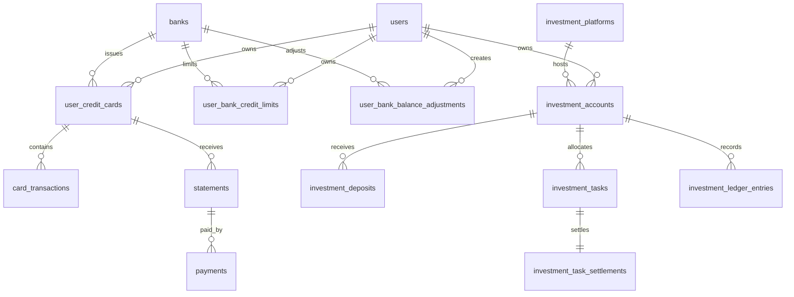

# ERD rút gọn

`user_bank_credit_limits` có unique `(user_id, bank_id)`; các thẻ của cùng user và bank dùng chung bản ghi hạn mức này.

`user_bank_credit_limits.balance_version` là phiên bản riêng cho dư nợ dùng chung và không làm thay đổi optimistic-lock `version` của hạn mức. `user_bank_balance_adjustments` là lịch sử append-only, unique `(user_id, bank_id, balance_version)`; mỗi dòng lưu balance gốc, balance trước/sau, amount thay đổi, offset, lý do và người thực hiện. Không có thao tác update hoặc delete adjustment trong application repository.

`user_credit_cards.card_type` lưu tên loại thẻ tự nhập với tối đa 150 ký tự. Cột cho phép `NULL` để giữ tương thích với dữ liệu đã tồn tại trước migration V9; API bắt buộc giá trị này cho mọi thao tác tạo hoặc cập nhật thẻ mới.

Không có foreign key giữa bảng nghiệp vụ Flow 1 và Flow 2.
