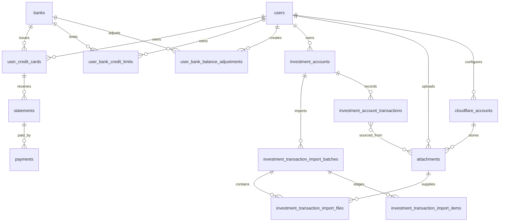

# ERD rút gọn

`user_bank_credit_limits` có unique `(user_id, bank_id)`; các thẻ của cùng user và bank dùng chung bản ghi hạn mức này.

`user_bank_credit_limits.balance_version` là phiên bản riêng cho dư nợ dùng chung và không làm thay đổi optimistic-lock `version` của hạn mức. `user_bank_balance_adjustments` là lịch sử append-only, unique `(user_id, bank_id, balance_version)`; mỗi dòng lưu balance gốc, balance trước/sau, amount thay đổi, offset, lý do và người thực hiện. Không có thao tác update hoặc delete adjustment trong application repository.

`user_credit_cards.card_type` lưu tên loại thẻ tự nhập với tối đa 150 ký tự. Cột cho phép `NULL` để giữ tương thích với dữ liệu đã tồn tại trước migration V9; API bắt buộc giá trị này cho mọi thao tác tạo hoặc cập nhật thẻ mới.

`investment_accounts` là bảng hồ sơ độc lập theo user. Bảng không còn `platform_id` hoặc các cột balance/capital/profit/reward.

V14 tạo `investment_account_transactions` làm lịch sử chính thức cùng các bảng batch/file/item staging và source links. Unique `(investment_account_id, deduplication_key)` và `(investment_account_id, external_transaction_id)` là lớp bảo vệ concurrent confirm cuối cùng. `attachments.ai_schema_version` giới hạn tái sử dụng AI result theo schema; `storage_purged_at` giữ audit/hash sau khi object R2 bị xóa.

V17 thêm capability tìm trọ: `lodging_listings` thuộc owner nhưng được đọc chung; `lodging_reference_locations` là danh mục điểm đến dùng chung; `lodging_listing_locations` giữ snapshot km/trạng thái Mapbox; `lodging_listing_images` liên kết attachment ảnh; `lodging_reviews` unique theo `(listing_id, user_id)` để mỗi user có đúng một review.

V18 thêm `ai_provider_accounts` cho danh sách Cloudflare Workers AI theo priority. API token chỉ lưu dưới dạng AES-256-GCM ciphertext; trạng thái kiểm tra, cooldown và lỗi an toàn gần nhất phục vụ failover mà không ghi token vào audit hoặc response.

V19 đổi bảng thành `cloudflare_accounts`, thêm model AI và credential/trạng thái R2 độc lập. `attachments.r2_account_id` cố định nơi lưu object; generated unique key bảo đảm chỉ một R2 account active làm primary. Attachment cũ để `NULL` cho tới khi Admin xác nhận gán vào bucket đã test.

V13 xóa các bảng legacy: `service_providers`, `merchants`, `mccs`, `card_transactions`, `cashback_records`, `discount_invoices`, `investment_platforms`, `investment_deposits`, `investment_tasks`, `investment_task_settlements`, `investment_rewards`, `investment_withdrawals` và `investment_ledger_entries`.
