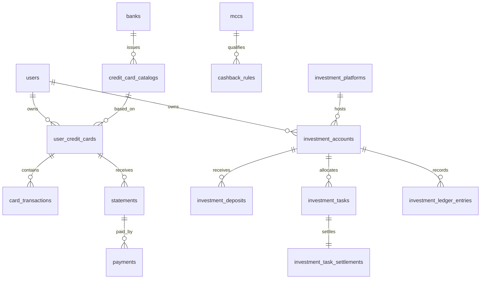

# ERD rút gọn

```mermaid
erDiagram
 users ||--o{ user_credit_cards : owns
 banks ||--o{ credit_card_catalogs : issues
 credit_card_catalogs ||--o{ user_credit_cards : based_on
 mccs ||--o{ cashback_rules : qualifies
 user_credit_cards ||--o{ card_transactions : contains
 user_credit_cards ||--o{ statements : receives
 statements ||--o{ payments : paid_by
 users ||--o{ investment_accounts : owns
 investment_platforms ||--o{ investment_accounts : hosts
 investment_accounts ||--o{ investment_deposits : receives
 investment_accounts ||--o{ investment_tasks : allocates
 investment_tasks ||--|| investment_task_settlements : settles
 investment_accounts ||--o{ investment_ledger_entries : records
```

Không có foreign key giữa bảng nghiệp vụ Flow 1 và Flow 2.

